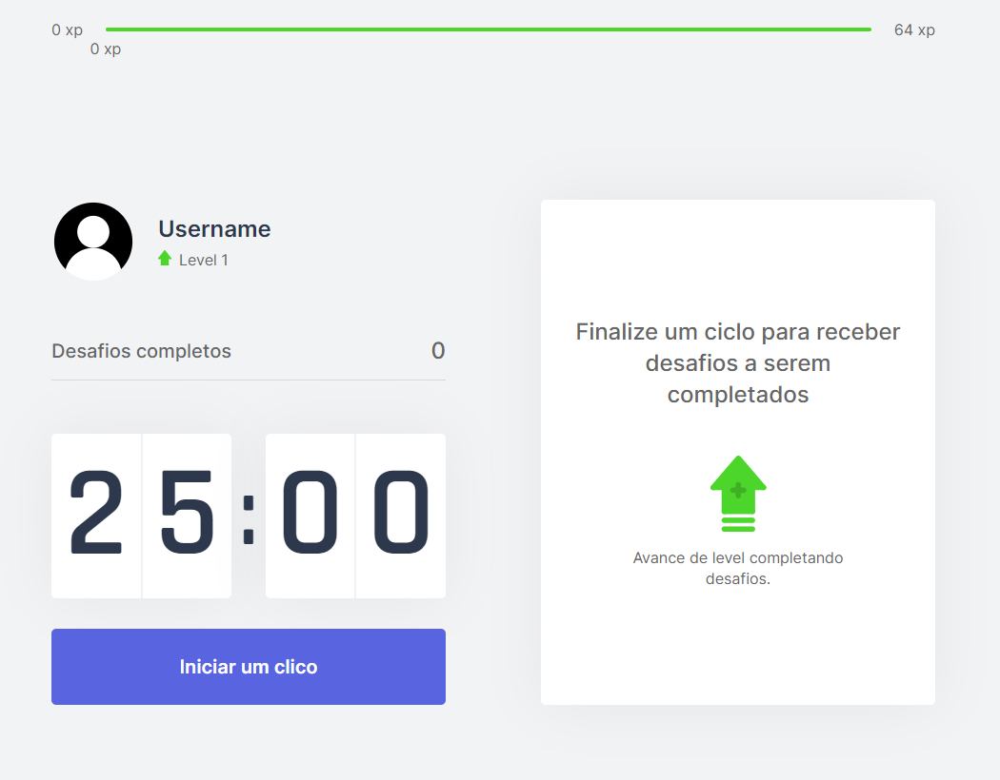
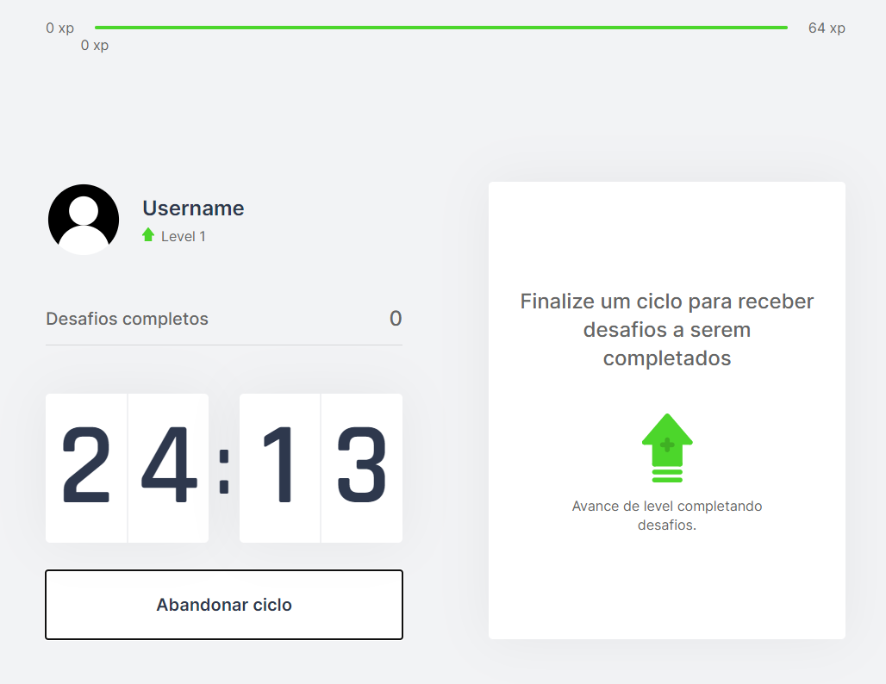
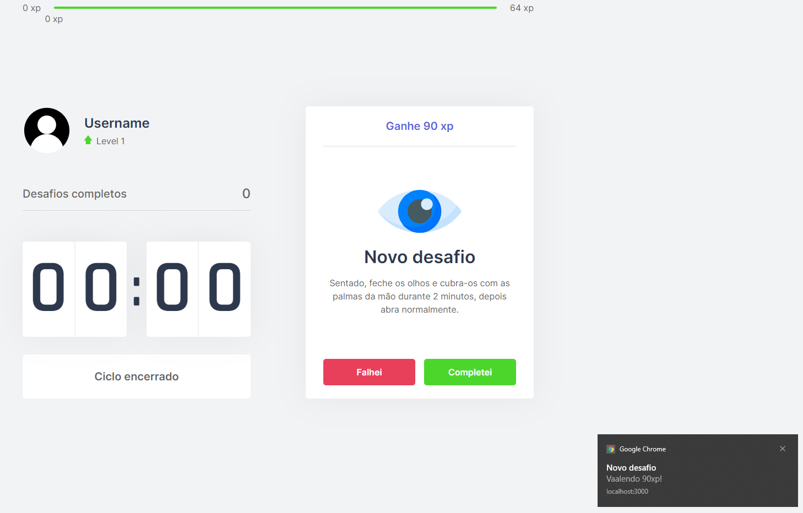
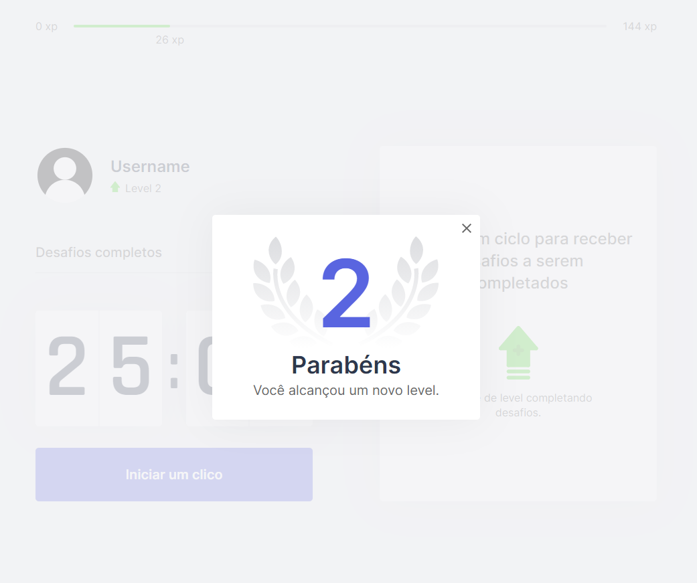

# Move-it | NextJS
I've made this web application during the Next Level Week#4 promoted by the Rocket Seat team! 

## Details
How to keep your focus and also get some beneffits for you help during this home office time? 
Use Move-it pomodoro timer and level up!

 ### Features:
 - All the backend is provided by NodeJS.
 - The frontend is made with React, CSS and NextJS!

### How do I run it?
- Clone the repository
- run 'npm install' at app folder. (I suggest you to use VSCode).
- After all packages being restored, run the command 'yarn dev'. 

#### Requirements
- Node JS
- yarn
- Code tool (VS Code).
 
## Authors

* **André Zottis** - *Initial work* - [AndreZottis](https://github.com/andrezottis)

## License

This project is licensed under the MIT License - see the [LICENSE.md](LICENSE.md) file for details

## Special Thanks
I just want to thank you [Rocketseat](https://rocketseat.com.br) for this awesome opportunity to learn more about those technologies. This week was really amazing and I've learned a lot!

## Some App Images

